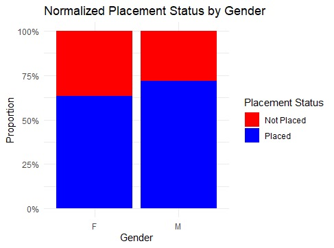

# **Project: Team Research and Development Assignment**

## **Overview**
This repository contains the code and resources for the **Team Research and Development Assignment** as part of the coursework. The project analyses placement status among students based on gender using statistical methods. It aims to draw meaningful conclusions about potential disparities and provide actionable insights.

Presentation Slides:
Key Points:

Introduce the research question and hypothesis.
Provide dataset overview and preprocessing steps.
Explain statistical methods (Chi-Square test, proportions) and results.
Include stacked bar charts and confidence intervals for visual support.
Interpret findings:
No statistically significant difference between genders.
Suggest focusing on other factors (e.g., academic performance, work experience).


## 1. Research Question and Hypothesis:
Research Question: Is there a difference in the proportions of placement status (placed vs. not placed) between male and female students?

Null Hypothesis (H₀): No difference exists in the proportions of employment status based on gender.

Alternative Hypothesis (H₁): A difference exists in the proportions of employment status based on gender.


## What's Inside


- **Hypothesis Testing**:
This hypothesis is tested to investigate potential disparities in placement outcomes based on gender. The analysis provides insights into whether placement programs should incorporate gender-specific interventions or focus on other factors influencing employability.

- **R_Visualization/**: R scripts used to create different visualizations of the data.

  BarPlot: Scripts specifically for generating bar plots.

.gitignore: Lists files that Git should ignore (like temporary files).

- **A-64 Team Research and Development Presentation Slide.pptx**: A PowerPoint presentation of our team research and result.
  
- **Dataset_Placement_Data_Full_Class.csv**: The main dataset containing students placement detail.


# **Project: Team Research and Development**

## **Getting Started**

### **Prerequisites**
- Ensure you have the following installed:
  - **R** and **RStudio**
  - Required R packages:
    - `ggplot2`
    - `dplyr`
    - `tidyr`

### **Setup Instructions**
1. Clone this repository to your local machine:
   ```bash
   git clone https://github.com/smhasan24/Project_Team_Research.git
   cd Project_Team_Research
   ```
2. Load the dataset into your preferred tool (e.g., R):
   ```r
   dataset <- read.csv("Path/To/Your/CSV_File.csv")
   ```
3. Explore the visualizations available in the `visualizations/` folder for initial insights.
4. Review the project summary in the PowerPoint presentation:  
   **`A-64 Team Research and Development Presentation Slide.pptx`**.

---

## **Features**
- Data preprocessing and cleaning scripts.
- Statistical analysis using Chi-Square tests.
- Visualizations, including bar charts and tables.
- Comprehensive R scripts for data exploration and hypothesis testing.
- Git log documentation for project transparency.

---

## **Research Question**
**"Is there a difference in the proportions of placement status (placed vs. not placed) between male and female students?"**

---

## **Repository Structure**

```
.
├── data/                # Dataset files
├── scripts/             # R scripts for data analysis
├── visualizations/      # Plots and visual outputs
├── git_log.xlsx         # Git log tracking all commits
├── README.md            # Project documentation
└── results/             # Final results and reports
```

---

## **Technologies Used**
- **R**: For statistical analysis and visualizations.
- **Git**: For version control.
- **GitHub**: For project management and file sharing.

---

## **Next Steps**
1. Open the `scripts/` directory and execute the R scripts in RStudio to process data, perform analysis, and generate visualizations.
2. Refer to the `results/` folder for final outputs and summary reports.


## **Results**
The key findings of the analysis will be included in the `results/` directory. Statistical outputs and visualizations are provided to support conclusions.

Analysis Methods:
Proportional Analysis:

The data was grouped by gender and status, and normalized proportions were calculated. Results:
Female Placement Rate: 63.2%
Male Placement Rate: 71.9% (Rcode)
Statistical Test:

Chi-Square Test:
Test Statistic: X-squared = 1.3818, df = 1
P-value: 0.2398 (p > 0.05)
Conclusion: Gender does not have a statistically significant impact on placement status​.
Logistic Regression (optional step in the updated code):

A logistic regression model was created with gender as the predictor for placement (status_binary coded as 1 for "Placed").
Summary outputs and confidence intervals were calculated​

**Implication**: Gender does not influence placement status, suggesting other factors (e.g., academic performance, work experience) may play a more critical role in determining placement outcomes.

# **Project: Team Research and Development Assignment**

## **Visualizations**
The project includes statistical visualizations generated using R. Below is an example of a stacked bar chart with normalized proportions created to visualize the relationship between gender and placement status:

### Stacked Bar Chart


> *This chart illustrates the proportion of placed and not placed students by gender.*

### How to View Visualizations
All visualizations are stored in the `visualizations/` directory. Clone the repository and navigate to the folder to view additional plots.


## **Contributing**
Contributions are welcome! If you’d like to improve or expand the project:
1. Fork the repository.
2. Create a feature branch:
   ```bash
   git checkout -b feature-name
   ```
3. Commit your changes:
   ```bash
   git commit -m "Add a new feature"
   ```
4. Push to your branch and create a pull request.

## **Data Privacy**
The dataset used in this project is anonymous and does not contain personally identifiable information (PII). All data used is for educational purposes only. No data is shared with third parties, and the repository is intended to demonstrate statistical analysis methods.

## **License**
This project is for educational purposes and is not distributed under any formal license.

## **Acknowledgements**
- **R Community**: Special thanks to the R community for creating and maintaining valuable resources for statistical analysis and visualization.
- **Stack Overflow**: For the helpful solutions and discussions that guided us through several implementation challenges.
- **GitHub**: For providing a platform for collaboration and version control throughout the project.

## **Contact**
For questions or feedback, please contact:
- **SM Hasan**: [GitHub Profile](https://github.com/smhasan24)
